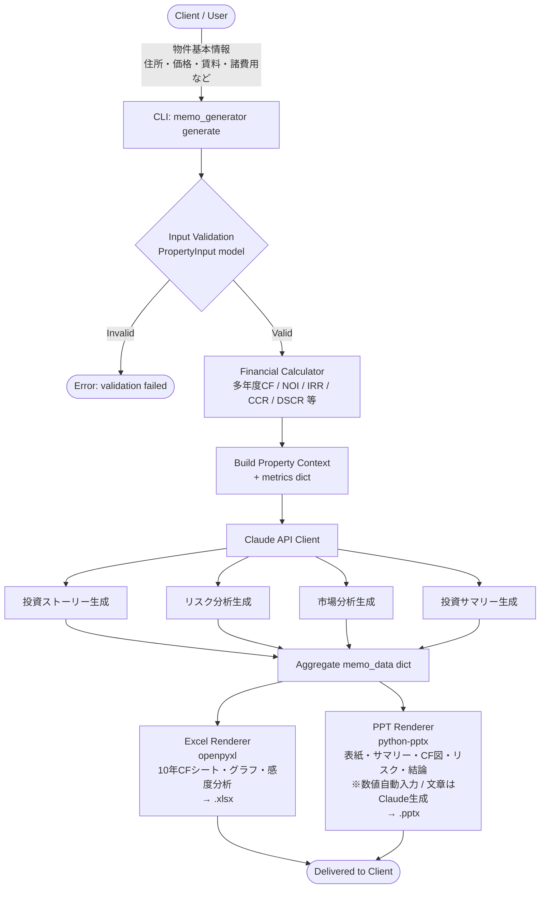
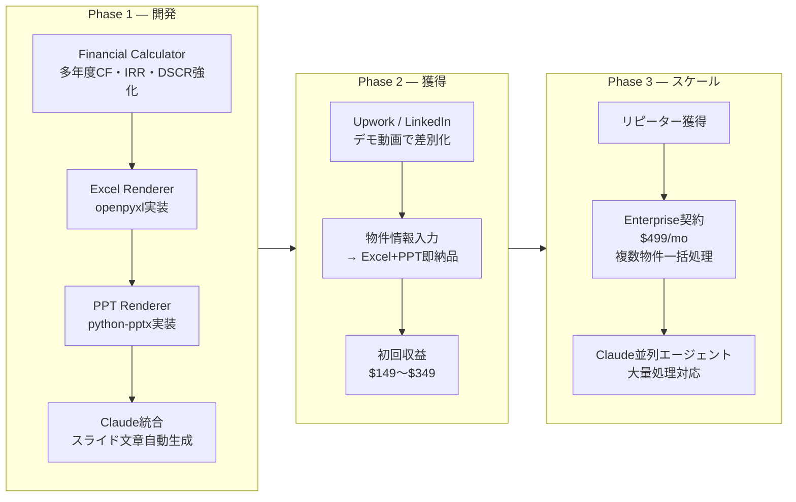
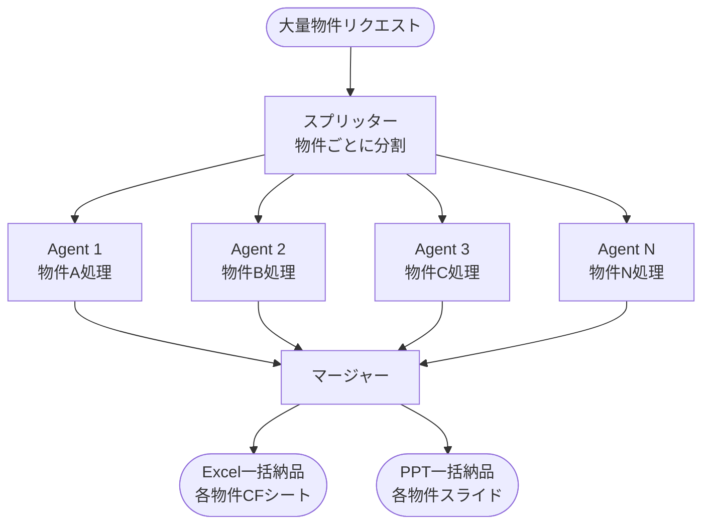

# System & Business Flow

## システムフロー（技術）

```mermaid
flowchart TD
    A([Client / User]) -->|物件基本情報\n住所・価格・賃料・諸費用など| B[CLI: memo_generator generate]
    B --> C{Input Validation\nPropertyInput model}
    C -->|Invalid| ERR([Error: validation failed])
    C -->|Valid| D[Financial Calculator\n多年度CF / NOI / IRR / CCR / DSCR 等]
    D --> E[Build Property Context\n+ metrics dict]
    E --> F[Claude API Client]

    F --> G1[投資ストーリー生成]
    F --> G2[リスク分析生成]
    F --> G3[市場分析生成]
    F --> G4[投資サマリー生成]

    G1 & G2 & G3 & G4 --> H[Aggregate memo_data dict]

    H --> I1[Excel Renderer\nopenpyxl\n10年CFシート・グラフ・感度分析\n→ .xlsx]
    H --> I2[PPT Renderer\npython-pptx\n表紙・サマリー・CF図・リスク・結論\n※数値自動入力 / 文章はClaude生成\n→ .pptx]

    I1 --> OUT([Delivered to Client])
    I2 --> OUT
```

---

## ビジネスフロー（収益化）

```mermaid
flowchart LR
    subgraph Phase1["Phase 1 — 開発"]
        A1[Financial Calculator\n多年度CF・IRR・DSCR強化] --> A2[Excel Renderer\nopenpyxl実装]
        A2 --> A3[PPT Renderer\npython-pptx実装]
        A3 --> A4[Claude統合\nスライド文章自動生成]
    end

    subgraph Phase2["Phase 2 — 獲得"]
        B1[Upwork / LinkedIn\nデモ動画で差別化] --> B2[物件情報入力\n→ Excel+PPT即納品]
        B2 --> B3[初回収益\n$149〜$349]
    end

    subgraph Scale["Phase 3 — スケール"]
        C1[リピーター獲得] --> C2[Enterprise契約\n$499/mo\n複数物件一括処理]
        C2 --> C3[Claude並列エージェント\n大量処理対応]
    end

    Phase1 --> Phase2 --> Scale
```

---

## Claude並列エージェント活用フロー

```mermaid
flowchart TD
    REQ([大量物件リクエスト]) --> SPLIT[スプリッター\n物件ごとに分割]

    SPLIT --> AG1[Agent 1\n物件A処理]
    SPLIT --> AG2[Agent 2\n物件B処理]
    SPLIT --> AG3[Agent 3\n物件C処理]
    SPLIT --> AGN[Agent N\n物件N処理]

    AG1 --> MERGE[マージャー]
    AG2 --> MERGE
    AG3 --> MERGE
    AGN --> MERGE

    MERGE --> OUT1([Excel一括納品\n各物件CFシート])
    MERGE --> OUT2([PPT一括納品\n各物件スライド])
```
